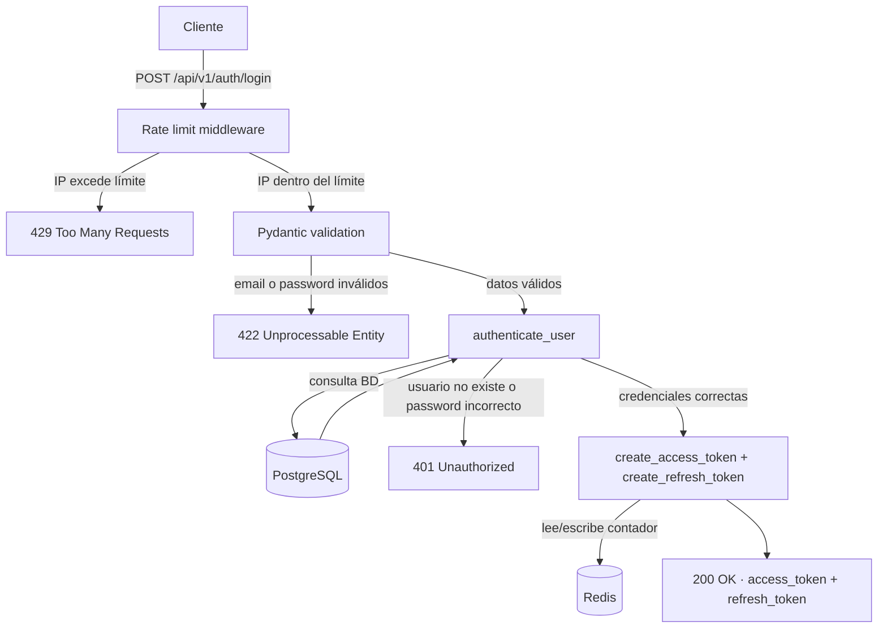

# auth-platform

```mermaid
flowchart TD
    A[Cliente] -->|POST /api/v1/auth/login| B[Rate limit middleware]
    B -->|IP excede límite| C[429 Too Many Requests]
    B -->|IP dentro del límite| D[Pydantic validation]
    D -->|email o password inválidos| E[422 Unprocessable Entity]
    D -->|datos válidos| F[authenticate_user]
    F -->|consulta BD| G[(PostgreSQL)]
    G --> F
    F -->|usuario no existe o password incorrecto| H[401 Unauthorized]
    F -->|credenciales correctas| I[create_access_token + create_refresh_token]
    I -->|lee/escribe contador| J[(Redis)]
    I --> K[200 OK · access_token + refresh_token]
```
