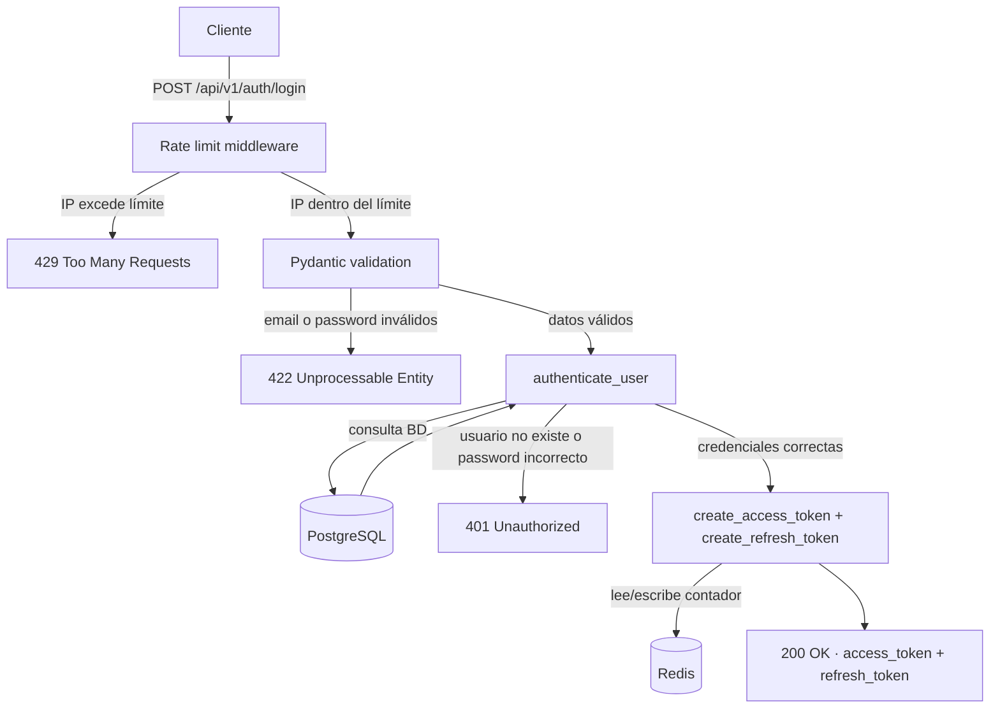
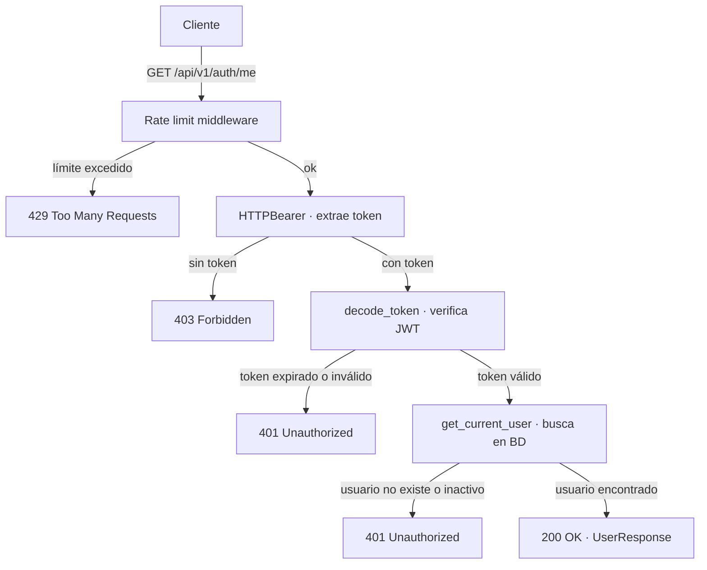

# auth-platform
# Auth Platform API

API backend de producción construida con FastAPI, PostgreSQL y Redis. Implementa autenticación JWT completa, rate limiting, caché, WebSockets y procesamiento de tareas en background con Celery.

## Stack

- **FastAPI** — framework web async de alto rendimiento
- **PostgreSQL** — base de datos principal con SQLAlchemy + Alembic
- **Redis** — caché, rate limiting y broker de Celery
- **Celery** — procesamiento de tareas en background
- **Docker** — PostgreSQL y Redis en contenedores

## Características

- Registro y login con JWT (access token + refresh token)
- Hash de contraseñas con bcrypt
- Rate limiting por IP con Redis
- Caché de endpoints con Redis y expiración automática
- Notificaciones en tiempo real con WebSockets
- Tareas en background (emails, reportes) con Celery
- Migraciones de BD con Alembic
- Documentación automática con Swagger/OpenAPI

## Cómo arrancarlo

### Requisitos
- Python 3.11+
- Docker y Docker Compose

### Instalación

```bash
git clone https://github.com/scrpti/auth-platform
cd auth-platform

python -m venv .venv
source .venv/bin/activate

pip install -e ".[dev]"

cp .env.example .env
```

### Arrancar servicios

```bash
# PostgreSQL y Redis
docker-compose up -d

# Migraciones
alembic upgrade head

# API (terminal 1)
fastapi dev app/main.py --port 8001

# Celery worker (terminal 2)
celery -A app.core.celery_app worker --loglevel=info
```

La API estará disponible en `http://localhost:8001/docs`

## Diagrama de flujos

### Diagrama de flujo de la ruta POST /api/v1/auth/login



### Diagrama de flujo de la ruta POST /api/v1/auth/me


